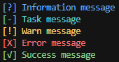

# garbageLogger

[](LICENSE)

## Description
I fr have no idea wtf im doing.

This project is a shit C# logger that supports five different logging levels: `INFO`, `TASK`, `WARN`, `ERROR`, and `SUCCESS`. The logger writes messages to the console and to a file specified by the user.

Made by [Yendy](https://github.com/YendisFish) and I for our [DAWN](https://github.com/The-Holy-Church-of-Terry-Davis/DAWN) project.

## Usage
```csharp
using garbageLogger.Logger;
//             Log dir   Log file name     Optional- default is true:
//                   V   V                  choose to overwrite the log file each run
Log Logger = new("logs", "Program.cs.log", overwrite=true);
// `Logger` will log to `./logs/Program.cs.log` and will erase the log file each time the program is ran. 

//           Message to log         Log level  
Logger.Write("Information message", LogLevel.INFO);
Logger.Write("Task message", LogLevel.TASK);
Logger.Write("Warn message", LogLevel.WARN);
Logger.Write("Error message", LogLevel.ERROR);
Logger.Write("Success message", LogLevel.SUCCESS);
```



## Conclusion
uhhh, check out the aforementioned [DAWN](https://github.com/The-Holy-Church-of-Terry-Davis/DAWN) project.
